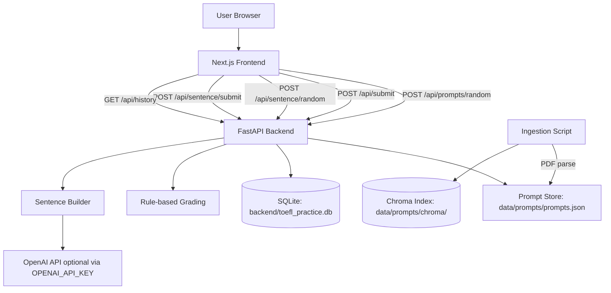

# TOEFL Writing Practice App

TOEFL practice platform with:
- Next.js frontend (`frontend/`)
- FastAPI backend (`backend/`)
- Prompt ingestion pipeline (`scripts/ingest_pdf.py`)

## Quick Start

```bash
npm install
npm run dev
```

Services:
- Frontend: `http://localhost:3000`
- Backend: `http://localhost:8000`

## Environment

Backend sentence generation can optionally use OpenAI:

```bash
# backend runtime environment
OPENAI_API_KEY=your_key_here
OPENAI_MODEL=gpt-4o-mini
```

Do not commit `.env` files. See `SECURITY.md`.

## Project Structure

```text
backend/
frontend/
data/prompts/
scripts/ingest_pdf.py
```

## Architecture Flow Diagram



More detail: `ARCHITECTURE.md`.
