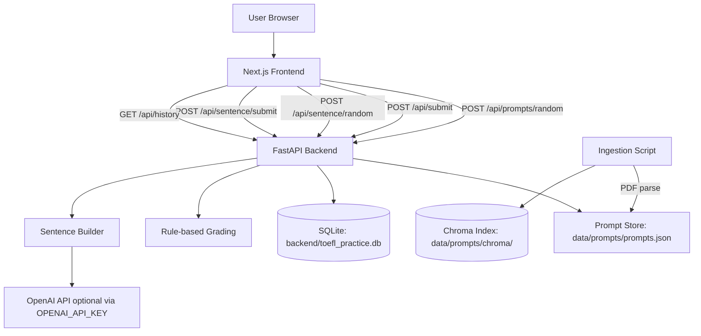

# TOEFL Writing Practice App

TOEFL practice platform with:
- Next.js frontend (`frontend/`)
- FastAPI backend (`backend/`)
- Prompt ingestion pipeline (`scripts/ingest_pdf.py`)

## Use Case

This application is designed for TOEFL Writing practice with timed response simulation, structured evaluation, and progress tracking.

Who it is for:
- TOEFL learners preparing for Email and Academic Discussion writing tasks.
- Instructors/coaches who want fast, rubric-style feedback workflows.
- Self-study users who want repeated drills with measurable improvement.

What users do:
1. Start a timed writing task (Email or Academic Discussion).
2. Submit a response and receive structured rubric feedback.
3. Practice Build-a-Sentence to improve grammar/word-order fluency.
4. Review history to track strengths, weaknesses, and score trends.

Why it is useful:
- Recreates exam-like timing and response pressure.
- Gives immediate, actionable feedback for iterative improvement.
- Supports consistent practice loops without manual scoring overhead.

## Quick Start

```bash
npm install
npm run dev
```

Services:
- Frontend: `http://localhost:3000`
- Backend: `http://localhost:8000`

## Environment

Backend sentence generation requires OpenAI:

```bash
# backend runtime environment
OPENAI_API_KEY=your_key_here
# optional override (default is gpt-5, with automatic fallback to gpt-4o-mini)
OPENAI_MODEL=gpt-5
```

Do not commit `.env` files. See `SECURITY.md`.

## Sentence Mode Notes

- Endpoint: `POST /api/sentence/random?count=1..10&difficulty=normal|hard|very_hard`
- Build-a-Sentence timer is always 6 minutes for all difficulty levels.
- The backend avoids repeating recent question prompts across generated sets.
- If OpenAI does not return enough unique items, backend responds with `503` and a retry message.

## Troubleshooting

- Frontend must target backend on port `8000`:
  - `frontend/.env.local` should contain `NEXT_PUBLIC_API_BASE=http://localhost:8000`
- Verify backend routes:
  - `http://localhost:8000/openapi.json` should include `/api/sentence/random` and `/api/sentence/submit`

## Project Structure

```text
backend/
frontend/
data/prompts/
scripts/ingest_pdf.py
```

## Architecture Flow Diagram



More detail: `ARCHITECTURE.md`.
