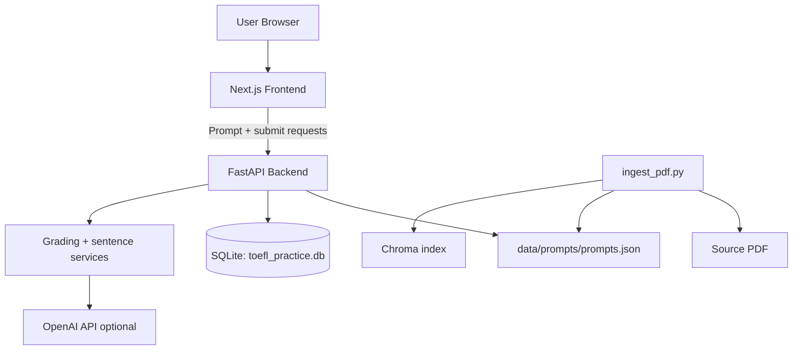

# TOEFL Writing Practice App

TOEFL practice platform with a Next.js frontend, a FastAPI backend, prompt ingestion from PDF source material, and SQLite-backed history tracking.

## What It Does

- Practice TOEFL Writing email tasks with a timer, prompt-specific task points, and live email-format checks.
- Practice TOEFL Academic Discussion tasks with timed free-response submission and rubric-style feedback.
- Practice Build-a-Sentence drills with generated sentence sets and automatic scoring.
- Review recent submissions in a history view backed by SQLite.
- Support optional student-specific prompt rotation to avoid repeating prompts too quickly.

## Tech Stack

- Frontend: Next.js 15, React 19, TypeScript, Tailwind CSS
- Backend: FastAPI, SQLAlchemy, SQLite
- Ingestion: Python script that parses a TOEFL PDF into `data/prompts/prompts.json` and a Chroma index
- Optional AI usage: OpenAI-backed sentence generation and prompt/name expansion when `OPENAI_API_KEY` is set

## Repository Layout

```text
backend/
  app/
frontend/
  app/
data/
  prompts/
scripts/
  ingest_pdf.py
toefl_practice.db
README.md
ARCHITECTURE.md
SECURITY.md
```

## Prerequisites

- Node.js 18+
- npm
- Python 3.11+ recommended

## Setup

Install frontend/monorepo dependencies:

```bash
npm install
```

Install backend dependencies:

```bash
python -m pip install -r backend/requirements.txt
```

Optional frontend environment override:

```bash
echo 'NEXT_PUBLIC_API_BASE=http://localhost:8000' > frontend/.env.local
```

The frontend already defaults to `http://localhost:8000` if `NEXT_PUBLIC_API_BASE` is not set.

## Run Locally

Start both apps from the repo root:

```bash
npm run dev
```

This starts:

- Frontend: `http://localhost:3000`
- Backend API: `http://localhost:8010`

Important: the frontend code defaults to `http://localhost:8000`, but the root `dev:backend` script currently starts FastAPI on port `8010`. You should do one of these:

1. Set `frontend/.env.local` to `NEXT_PUBLIC_API_BASE=http://localhost:8010`
2. Or start the backend manually on port `8000`

Manual startup:

```bash
python -m uvicorn backend.app.main:app --reload --port 8000 --app-dir .
cd frontend && npm run dev
```

## Data and Persistence

- Prompt bank: `data/prompts/prompts.json`
- SQLite database: `toefl_practice.db`
- Prompt ingestion source PDF: `Mail and Discussion 2026.pdf`
- Chroma prompt index: generated under a directory you choose when running ingestion

The backend creates database tables automatically on startup and applies a lightweight migration for added submission columns.

## Environment Variables

OpenAI is optional, but some runtime generation paths use it when available.

```bash
OPENAI_API_KEY=your_key_here
OPENAI_MODEL=gpt-5
```

Notes:

- `OPENAI_MODEL` is optional.
- `backend/app/services/prompt_store.py` defaults to `gpt-4o-mini` for one runtime path.
- `ARCHITECTURE.md` still mentions `gpt-5` as a default for sentence generation, so treat the code as the source of truth.
- Do not commit `.env` files. See `SECURITY.md`.

## Prompt Ingestion

Use the ingestion script to parse a TOEFL PDF and rebuild prompt artifacts:

```bash
python scripts/ingest_pdf.py \
  --pdf "Mail and Discussion 2026.pdf" \
  --output-json data/prompts/prompts.json \
  --chroma-dir data/prompts/chroma
```

The script:

- extracts text from the source PDF
- classifies prompts as `email` or `discussion`
- writes structured prompt JSON
- rebuilds a local Chroma collection for prompt search/indexing

If PDF parsing fails, install either `pypdf` or `pdfplumber` in your Python environment.

## Core API

- `POST /api/prompts/random?task_type=email|discussion`
- `POST /api/prompts/random?task_type=email|discussion&student_id=...`
- `POST /api/submit`
- `GET /api/history`
- `GET /api/history?student_id=...`
- `POST /api/sentence/random?count=1..10&difficulty=normal|hard|very_hard|extra_tough`
- `POST /api/sentence/submit`

OpenAPI schema:

- `http://localhost:8000/openapi.json`
- or `http://localhost:8010/openapi.json` if you use the root dev script unchanged

## Feature Notes

### Writing Tasks

- Email prompts are sanitized before display and before history rendering.
- Email submissions are checked for subject line, greeting, sign-off, and rough bullet-point coverage.
- Discussion submissions are checked for response relevance, peer-reference behavior, and minimum word count.
- Submissions store both scores and a prompt snapshot for later review.

### Sentence Builder

- Supported difficulties: `normal`, `hard`, `very_hard`, `extra_tough`
- Question count range: `1` to `10`
- Timer: fixed at `6` minutes
- Generated sentence sets are cached so they can still be graded after creation
- The backend reduces short-term prompt repetition and returns `503` when it cannot generate a sufficiently unique set

## Troubleshooting

- `Cannot connect to backend`: check `NEXT_PUBLIC_API_BASE` and make sure frontend/backend ports match.
- `No prompts found`: run the ingestion script to rebuild `data/prompts/prompts.json`.
- `Sentence set not found. Start a new set.`: the cached/generated set is missing; request a fresh sentence set.
- PDF ingestion dependency error: install `pypdf` or `pdfplumber`.

## Architecture

High-level flow:


```mermaid
flowchart TD
    U[User Browser] --> F[Next.js Frontend]
    F -->|Prompt + submit requests| B[FastAPI Backend]
    B --> P[data/prompts/prompts.json]
    B --> D[(SQLite: toefl_practice.db)]
    B --> S[Grading + sentence services]
    S --> O[OpenAI API optional]

    I[ingest_pdf.py] --> PDF[Source PDF]
    I --> P
    I --> C[Chroma index]
```

More detail: `ARCHITECTURE.md`
